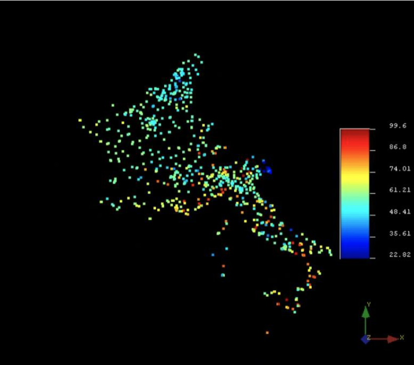

[](https://doi.org/10.5281/zenodo.16905229)


# A Comprehensive Study on the Density of Ozone (O3) in Five European Countries
(Environmental O3 Density Analysis, Variogram Modeling, and Kriging Mapping)


# Data visualization by using Sgems

This project presents a **comprehensive geostatistical analysis** of ground-level ozone (O₃) concentrations across five European countries: **Netherlands, Belgium, France, Switzerland, and Italy**. Using a combination of statistical analysis, variogram modeling, and kriging interpolation, the study provides insights into the spatial distribution of O₃ density for environmental monitoring and policy-making.

---

## 📌 Project Overview

Ground-level ozone is a harmful air pollutant with significant **health, ecological, and climate impacts**. The aim of this project is to:
- Assess the spatial distribution of O₃ concentrations.
- Model spatial dependencies using different variogram models.
- Generate predictive maps using kriging techniques.

---

## 🌍 Data Collection & Preprocessing

1. **Source**:  
   European Environment Agency (EEA) air quality data.

2. **Countries Analyzed**:  
   - Netherlands  
   - Belgium  
   - France  
   - Switzerland  
   - Italy

3. **Steps**:
   - Extracted ozone concentration data from monitoring stations.
   - Retrieved latitude/longitude coordinates for each station.
   - Converted coordinates to **UTM Zone 32N** using R (`sf` and `rgdal` packages).
   - Cleaned and formatted data for use in **SGems**.

4. **Dataset Summary**:
   - **Data Points**: 738  
   - **Mean O₃**: 60.22  
   - **Variance**: 127.51  
   - **Range**: 22.82 – 99.60

---

## 📊 Statistical & Geostatistical Analysis

### 1. Histogram & Descriptive Statistics
- Visualized the frequency distribution of ozone concentrations.
- Computed mean, median, variance, and range.


### 2. Variogram Modeling
- Evaluated **four variogram models**: Linear, Spherical, Gaussian, and Exponential.
- Modeled anisotropy with azimuths 0° and 90°.
- Cross-validated using **MSE, RMSE, MAE**.
- Selected **Exponential model** as the best fit based on lowest error metrics.

Experimental Variogram
 

Experimental and Fitted Variogram Exponential Azimuth 0-90


### 3. Kriging Interpolation
- Conducted **Ordinary Kriging** and **Simple Kriging** using SGems.
- Produced:
  - O₃ concentration maps.
  - Kriging variance maps for uncertainty estimation.
 
Exponential Ordinary Kriging
 

Exponential Ordinary Kriging variance


Exponential Simple Kriging
 

Exponential Simple Kriging Variance
 


---

## 🛠 Tools & Technologies

- **R** (data processing, statistical analysis, variogram modeling)
  - Packages: `gstat`, `sp`, `sf`, `rgdal`, `raster`
- **SGems** (geostatistical mapping)
- **Excel** (result compilation)
- **GIS** concepts for spatial data analysis

---

# 📜 R Script: O₃ Variogram Analysis and Kriging Cross-Validation

This section documents the R script used in the **Environmental O₃ Density Analysis** project.  
It explains **each part of the code**, its purpose, and how it fits into the workflow.

---

## 1️⃣ Load Required Libraries

```r
install.packages("gstat")
library(gstat)
library(sp)
```

## 2️⃣ Load the O₃ Dataset
```r
input_csv_file <- "C:\\Users\\navid.tavakoli\\Desktop\\data.csv"
df <- read.csv(input_csv_file, header = TRUE)
```
- Reads the dataset containing X, Y coordinates and O₃ density into a dataframe df.

## 3️⃣ Compute Pairwise Distances Between Stations
```r
distances <- list()
for (i in 1:(nrow(df) - 1)) {
  for (j in 1:(nrow(df) - 1)) {
    d <- sqrt((df$X[i] - df$X[j])^2 + (df$Y[i] - df$Y[j])^2)
    if (d > 0) { 
      distances <- c(distances, d)
      print(paste("Length of distances list:", length(distances)))
    }
  }
}

```

- Loops through all station pairs and calculates Euclidean distances.
- Stores all distances in distances list.

## 4️⃣ Load Flattened Distance Data
```r
my_data <- read.csv("C:\\Users\\navid.tavakoli\\Desktop\\flat_distances.csv")
flat_distances <- unlist(my_data)
```
- Reads a CSV file with all distances flattened into one column.
- Converts the list into a numeric vector.

## 5️⃣ Calculate Basic Statistics
```r
min_distance <- round(min(flat_distances, na.rm = TRUE), digit = 0)
max_distance <- round(max(flat_distances, na.rm = TRUE), digit = 0)
average_distance <- mean(flat_distances, na.rm = TRUE)
variance_distance <- round(var(flat_distances, na.rm = TRUE), digit = 0)
standard_deviation <- round(sqrt(variance_distance), digit = 0)

```

- Computes minimum, maximum, mean, variance, and standard deviation of distances.

## 6️⃣ Determine Spatial Extent
```r
max_X <- max(df$X); min_X <- min(df$X)
max_Y <- max(df$Y); min_Y <- min(df$Y)
dimension_X <- max_X - min_X
dimension_Y <- max_Y - min_Y
half_of_field <- round(max(dimension_X, dimension_Y) / 2, digit = 0)

```
- Calculates bounding box dimensions for the dataset.
- Determines half of the maximum spatial extent (used for lag calculation).


## 7️⃣ Calculate Variance of Density and Lag Parameters
```r
var_density <- round(var(df$Density), digit = 0)
lag_separation <- 6
number_of_lags <- round(half_of_field / lag_separation, digits = 0)
lag_tolerance <- (lag_separation / 2)

```
- Computes variance of O₃ density values.
- Defines lag separation, number of lags, and lag tolerance for variogram calculation.

## 8️⃣ Create SpatialPointsDataFrame
```r
valid_density <- !is.na(df$Density) & is.numeric(df$Density) & df$Density >= 0
df <- df[valid_density, ]
sp_points <- SpatialPointsDataFrame(coords = df[, c("X", "Y")], data = df)

```
- Removes invalid density values.
- Converts the dataframe to a spatial object for geostatistical operations.


## 9️⃣ Compute Experimental Variograms
```r
cutoff_distance <- 1200
v_azimuth0 <- variogram(Density ~ 1, sp_points, alpha = c(0, 0), cutoff = cutoff_distance, width = lag_separation)
v_azimuth90 <- variogram(Density ~ 1, sp_points, alpha = c(90), cutoff = cutoff_distance, width = lag_separation)

```
- Computes experimental variograms for azimuth 0° and azimuth 90°.


## 🔟 Save Variogram Plots
```r
png("variogram_azimuth0.png", width = 1000, height = 600, res = 150)
plot(v_azimuth0, col = "red", lty = 2, lwd = 2, main = "Variogram: Azimuth 0")
dev.off()

png("variogram_azimuth90.png", width = 1000, height = 600, res = 150)
plot(v_azimuth90, col = "green", lty = 3, lwd = 2, main = "Variogram: Azimuth 90")
dev.off()

```
- Saves variogram plots for both azimuths.

## 1️⃣1️⃣ Fit Variogram Models
```r
model_sph1 <- fit.variogram(v_azimuth0, model = vgm("Sph", psill = 70, range = 100, nugget = 48))
model_exp1 <- fit.variogram(v_azimuth0, model = vgm("Exp", psill = 70, range = 100, nugget = 48))
model_gauss1 <- fit.variogram(v_azimuth0, model = vgm("Gau", psill = 70, range = 100, nugget = 48))
model_lin1 <- fit.variogram(v_azimuth0, model = vgm("Lin", psill = 70, range = 100, nugget = 48))

```
- Performs leave-one-out cross-validation for each model and azimuth.

## 1️⃣2️⃣ Cross-Validation

```r
kriging_cv_model_exp1 <- krige.cv(Density ~ 1, sp_points, model = model_exp1)

```


- Performs leave-one-out cross-validation for each model and azimuth.

## 1️⃣3️⃣ Compute Error Metrics

```r
calculate_mse <- function(observed, predicted) { mean((observed - predicted)^2, na.rm = TRUE) }
calculate_rmse <- function(observed, predicted) { sqrt(mean((observed - predicted)^2, na.rm = TRUE)) }
calculate_mae <- function(observed, predicted) { mean(abs(observed - predicted), na.rm = TRUE) }


```
- Defines functions to calculate MSE, RMSE, MAE, Mean Normalized Error, and Variance of Normalized Error.


1️⃣4️⃣ Save Results

```r
error_results <- data.frame(
  Model = c(...),
  MSE = c(...),
  RMSE = c(...),
  MAE = c(...),
  Mean_of_Normalized_Error = c(...),
  Variance_of_Normalized_Error = c(...)
)
write.csv(error_results, file = "Error_Result.csv", row.names = FALSE)


```

- Stores performance metrics for all models in Error_Result.csv.

Author: Navid
